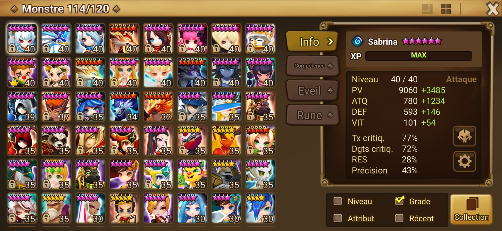

# Image Recognition by color pattern with Summoners war 

Recognition of mobs on a screenshot from summoners war.\
To read the full explaination article, please [read here](https://medium.com/multi-image-recognition-by-color-patterns-game/multi-image-recognition-by-color-patterns-game-application-4cdb2ff9c6f1)!
This program found all the mob on the screenshot, whatever the size and the ratio of the screen, the type of the phone, the format of the image.\
Please only a box screenshot is allowed, of this type:\


## Installation

Use the package manager [pip](https://pip.pypa.io/en/stable/) to install emoji, pillow, matplotlib, opencv-python.

```bash
git clone https://github.com/BuiloDiCarpaccio/Image-Recognition-by-color-pattern-with-Summoners-war.git
pip install emoji pillow matplotlib opencv-python
```

## Usage

To run the test config
```python
python3 run --test
```

To run the program with your own screenshots
```python
python3 run --screenshot [path of your screenshot]
```

## Contributing
Pull requests are welcome. For major changes, please open an issue first to discuss what you would like to change.

Please make sure to update tests as appropriate.

## License
[MIT](https://choosealicense.com/licenses/mit/)
